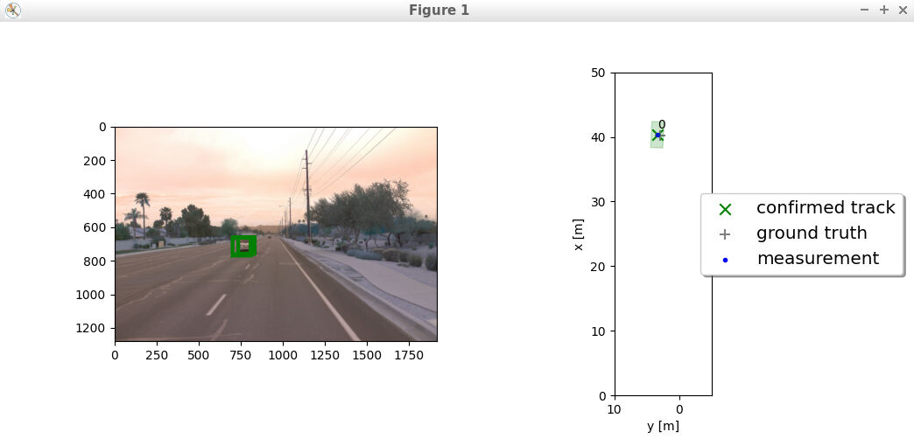
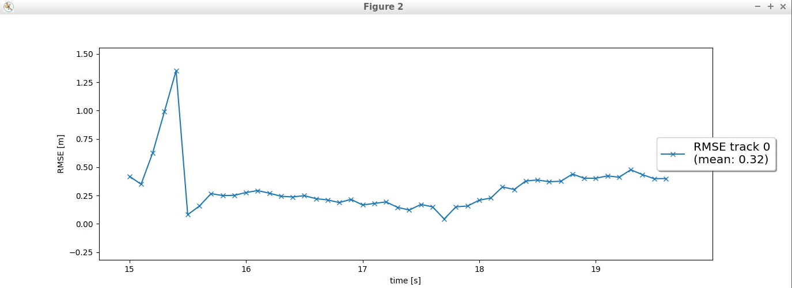
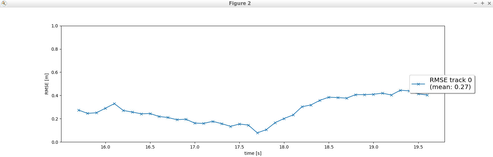
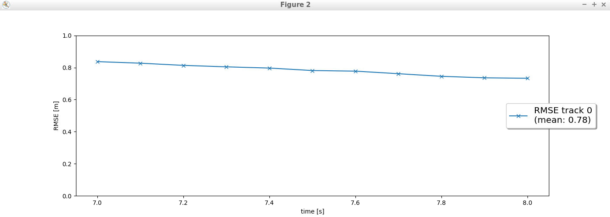
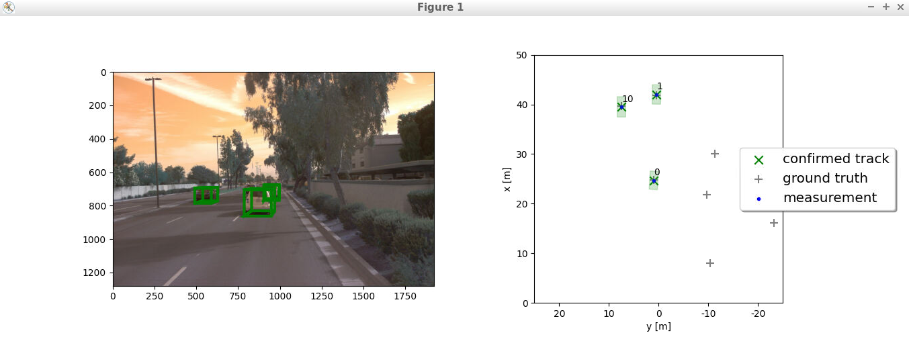
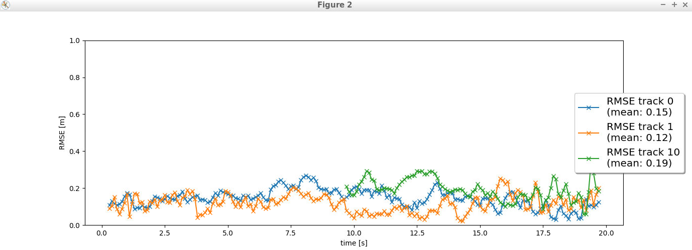
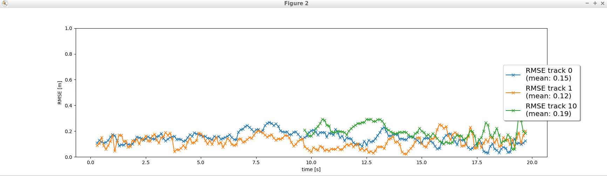

# Writeup: Track 3D-Objects Over Time

## Step 1 - Track objects over time with a Kalman Filter

The first step in the final Sensor Fusion project was to implement a Extended Kalman Filter and show the results on a single track.

When I first implemented the filter, I didn't realize I had an math error in the S() and update(...) functions. This resulted in:

In the next step, I realized my mistake after getting bad results. The result of this fix was an improvement in the RMSE:

NOTE: I had to edit some of the loop_over_dataset.py paths because the results folder was different than the midterm's.

## Step 2 - Initialize, update and delete tracks

In the second step of the final project, I implemented a track management system that initialized and deleted tracks as well as setting state and score for tracks.

As seen by the terminal output, the track, that was previously detected but went out of range, is deleted around the 97 frame. I expected the deletion to happen a bit sooner. But, the RMSE was 0.78 which seemed like it was in bounds for this step.

## Step 3 - Associate measurements to tracks with nearest neighbor association

The next step was to implement a simple single, nearest neighbor data measurement association to each track. My implementation managed to detect three different tracks with a pretty good RMSE.

## Step 4 - SWBAT fuse measurements from lidar and camera

The last step was to implement a nonlinear, camera measurement model alongside the LiDAR model.

After implementing this, I got the same RMSE for each detected track. I found it interesting that the RMSE didn't change between adding in the camera model as I expected it to potentially improve the results or detect new tracks not seen by the LiDAR.

### 1. Write a short recap of the four tracking steps and what you implemented there (filter, track management, association, camera fusion). Which results did you achieve? Which part of the project was most difficult for you to complete, and why?

See above for both my results and a recap of each step. The hardest part for me to complete was getting the math portions correctly. I had a few errors in step 1 which resulted in debugging in step 2. I also ran into this with math errors in step 3 and discovered it in step 4.

### 2. Do you see any benefits in camera-lidar fusion compared to lidar-only tracking (in theory and in your concrete results)? 

In my results, I wasn't able to see any difference between the two. However, I expected to see an improvement in identify both true and ghost tracks.

### 3. Which challenges will a sensor fusion system face in real-life scenarios? Did you see any of these challenges in the project?

Sensor fusion faces general obstruction from refracted light from guard-rails and other shiny surfaces to poor weather conditions like rainy, muddle terrain. However, by gathering data from multiple sensor sources, it allows the system to get a much better prediction of the scene that's happening and how to make the best decisions. However, I didn't see any of these problems in this project.

### 4. Can you think of ways to improve your tracking results in the future?

I think adding in a more complex track scoring implementation would improve the results (or at least give a better confidence with the prediction). Additionally, I think adding in additional sensors models could improve the tracking results.
