# Sensor Fusion - 3D Object Detection

This midterm project focused on object detection using measurements from LiDAR and camera data. The LiDAR data was used to create birds-eye view (BEV) perspectives of 3D point-clouds. In the last section, performance metrics (precision and recall) were used to evaluate the performance of the detection algorithm.

All code associated with ID_S<number>_EX<number> sections can be found in the student directory (objdet_detect.py, objdet_eval.py, objdet_pcl.py).

## Section 1: Compute LiDAR Point-Cloud from Range Image

### ID_S1_EX1 - Visualize range image channels

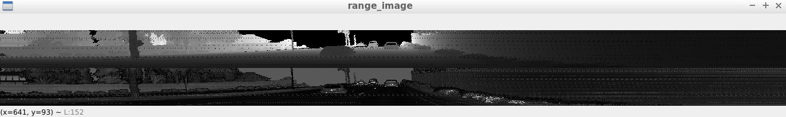

### ID_S1_EX2 - Visualize LiDAR Point Cloud

In this first image, I've boxed what I believe to be vehicles in red. The orange boxes indicate that I'm not positive that it's fully picking up the frame correctly and might be a false positive. This image is a bit blurry but, in the lower left corner, you can see an outline of a truck (that I followed around in a few different frames) and two cars beside it.
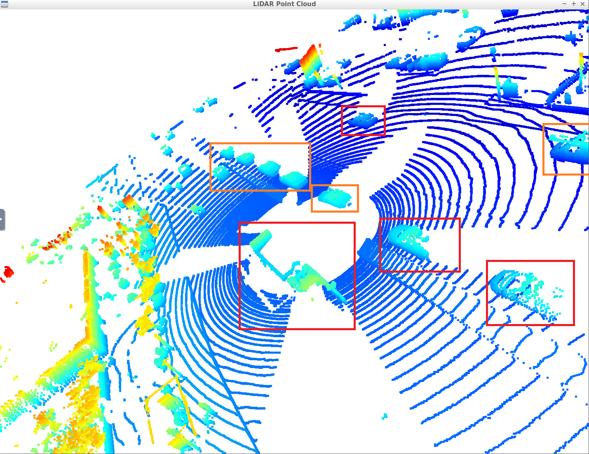

In this next image, I highlighted the truck in a yellow box where you can see it's hood, side mirror, and flatbed. I also highlighted a car in red and you can see it's tires, side mirror, and roof top rack outline.
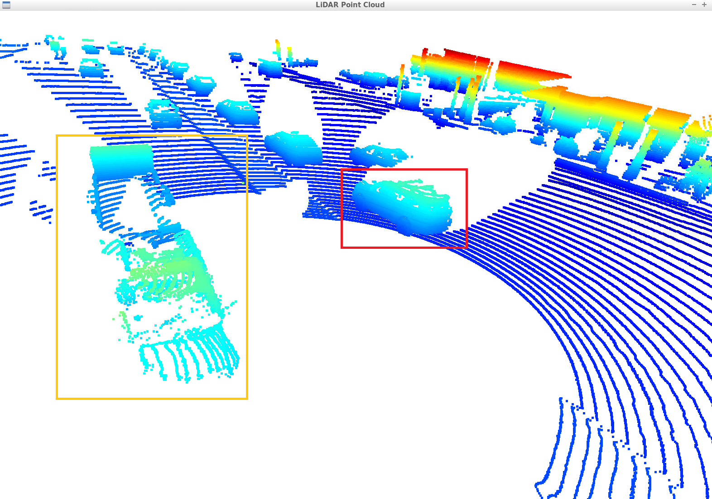

For this image, you can clearly see the outline of two cars with tires, side mirrors, and windows. Additionally, for one car, it looks like you can see it's antenna.
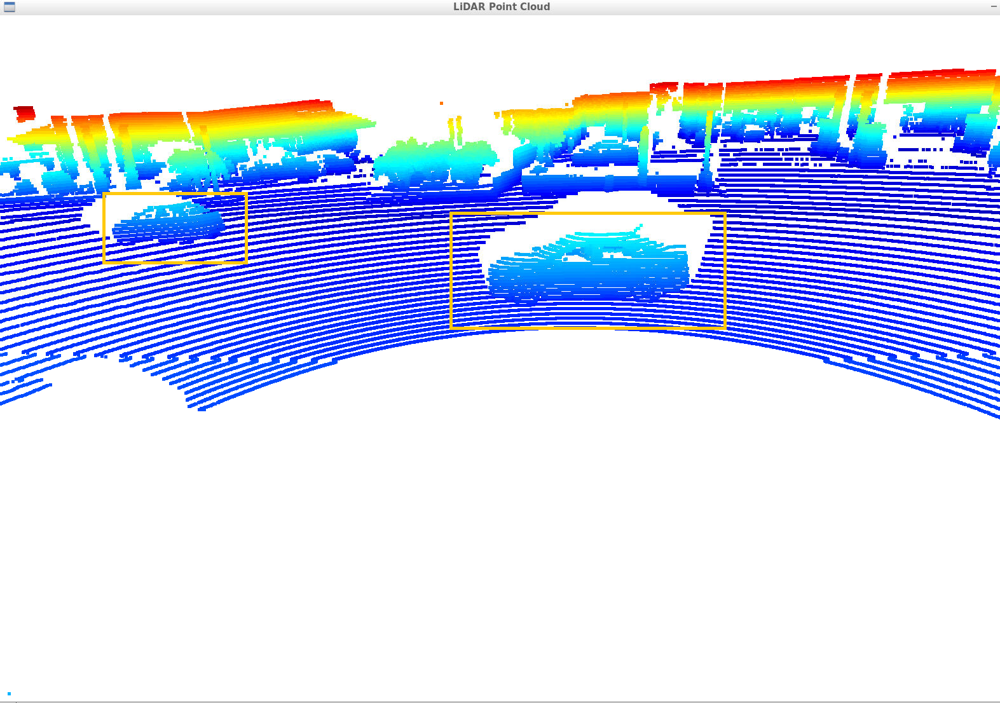

For image 4, you can see an outline of another car, although it's pretty blurry. Also, you can see the outlines of what it appears to be road signs.
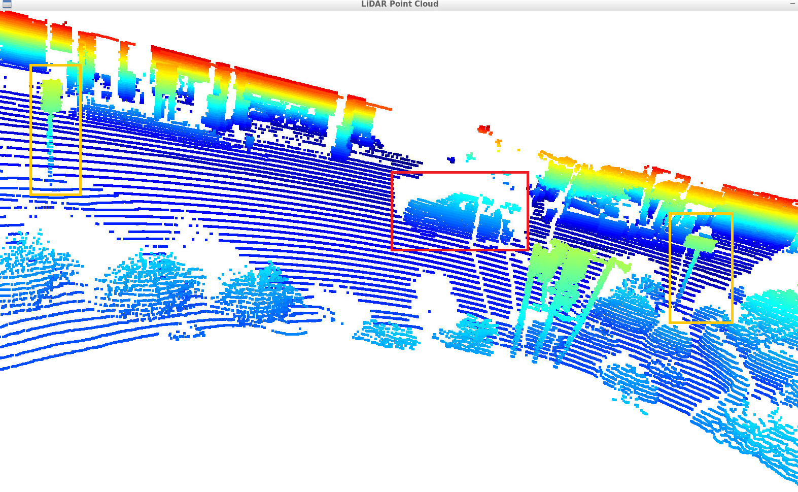

In this last image, you can see an outline of potentially a work vehicle with something on top of it's roof. Additionally, you can see some road barriers directly in front of that vehicle as well.
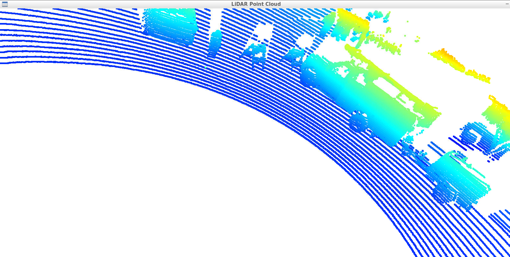

## Section 2 : Create Birds-Eye View from Lidar PCL

### ID_S2_EX1 - Convert sensor coordinates to BEV-map coordinates

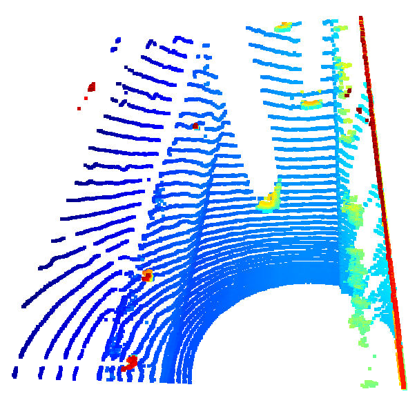

### ID_S2_EX2 - Compute intensity layer of the BEV map

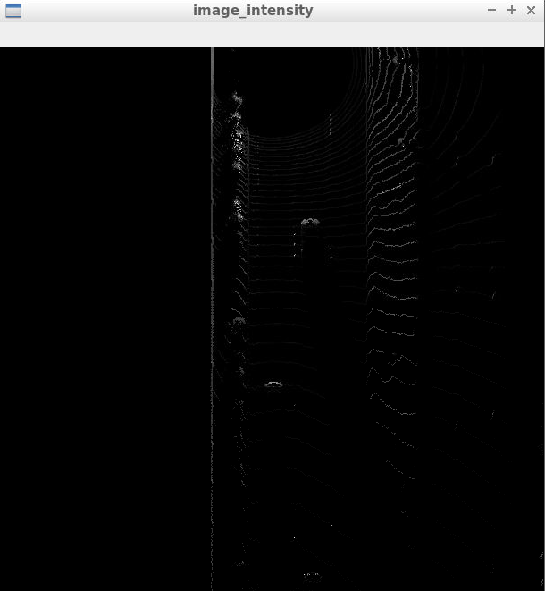

### ID_S2_EX3 - Compute height layer of the BEV map

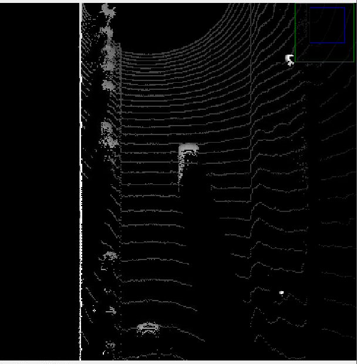

## Section 3 : Model-based Object Detection in BEV Image

### ID_S3_EX2 - Extract 3D bounding boxes from model response

#### Frame 50:
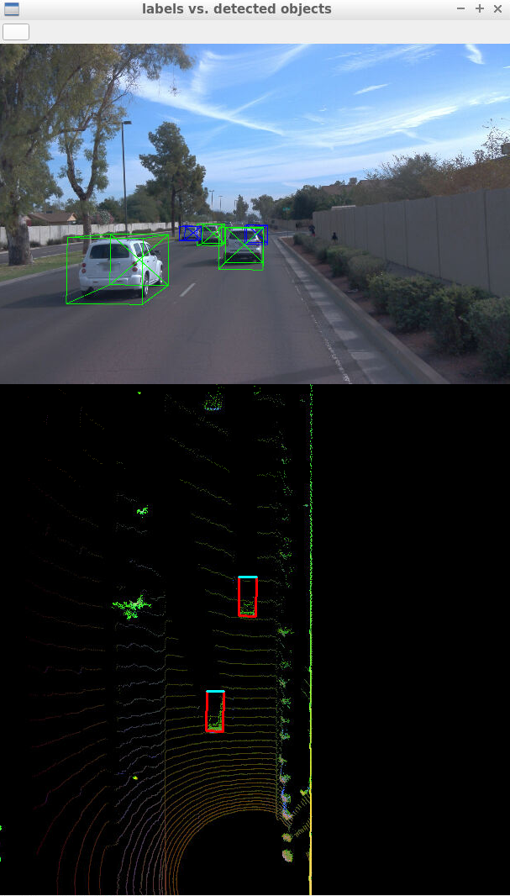

#### Frame 51:
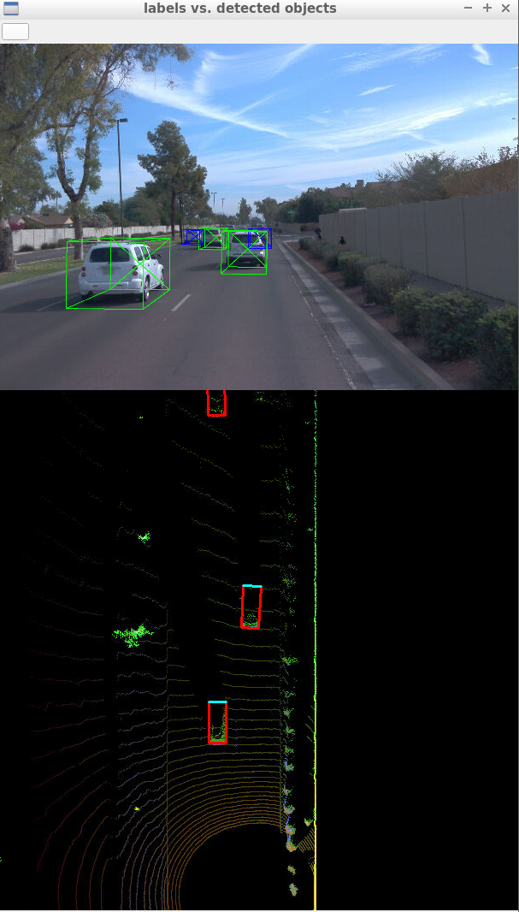

## Section 4 : Performance Evaluation for Object Detection

### ID_S4_EX3 - Compute precision and recall

#### Precision and Recall with implementation
")

For my implementation, I was getting a precision of 0.9508196721311475 and a recall of 0.94771241830006536. This wasn't exactly like the example's precision and recall but it seemed close enough. Additionally, I'm not sure why the position errors in x and y are showing lines like that.

#### Sanity Check Precision and Recall
")

For the sanity check, I was getting to expected values of 1.0 for both precision and recall.
